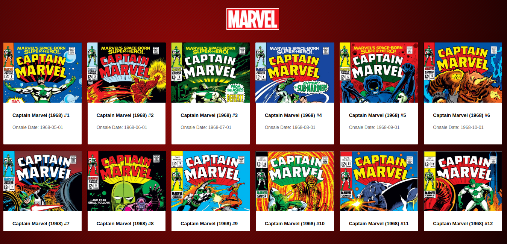
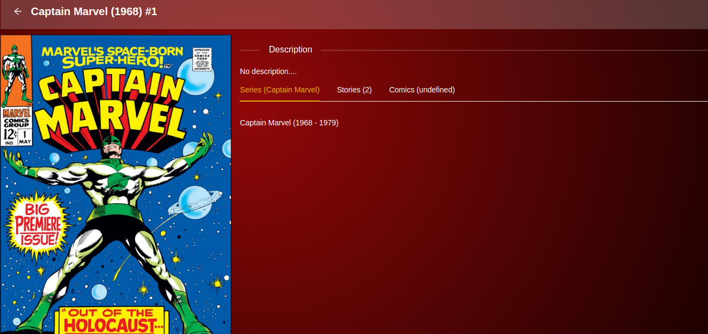
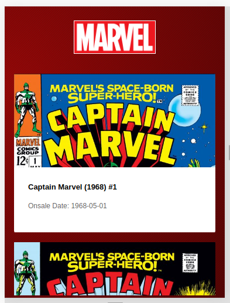

# Marvel Cards

Este projeto web é um teste onde listo os cards - Captain Marvel.

## Screenshots

### Browser List: 


### Browser Details: 


### Mobile Perspectiva: 



## Bibliotecas utilizadas

- axios - Usada para acessar as APIs.
- moment - Lidar com datas e/ou timestamps.
- react-loadable - Carregamento de páginas assincronas.
- react-router-dom - Gerenciar Rotas e navegação em nossa aplicação.
- md5 - Em virtude da API da marvel necessitar do codigo md5 da concatenação das chaves e timestamp.
- react-icons - obter opções de icons.

## Getting Started

1. Obter as credenciais na [API da Marvel](https://developer.marvel.com/documentation/getting_started)
2. Configurar as variáveis de ambiente:

- _REACT_APP_private_key_
- _REACT_APP_public_key_
- _NODE_ENV_

### Prerequisitos

1. NodeJS/npm previamente instalado.

### Instalando as dependências

```
yarn
```

ou

```
npm install
```

## Rodando o projeto

```
yarn start
```

## Construído com

- [ReactJS](https://pt-br.reactjs.org/) - Biblioteca Front-end.
- [Ant Design](https://ant.design/) - React UI library utilizado.
- [API Marvel](https://developer.marvel.com/docs) - API da marvel.


## Autor

- **Orlando Neto** - [orlandoneto](https://github.com/orlandoneto)